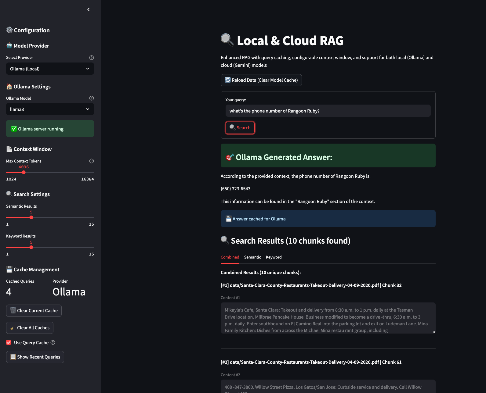

# Local RAG Pipeline with Gemini & Ollama

This project is a local Retrieval-Augmented Generation (RAG) pipeline that supports both cloud (Gemini) and local (Ollama) LLMs. It processes documents in various formats (PDF, DOCX, TXT, images, etc.), builds a vector database, and enables semantic search and LLM-powered Q&A via web interface.

---

## Features
- **Document parsing** for PDFs, DOCX, TXT, images, and more
- **Sentence-based chunking** (8 sentences, 3 overlap) for better context
- **Embedding** with Sentence Transformers
- **Vector search** with FAISS + BM25 hybrid search
- **Query caching** for fast repeated queries
- **Configurable context window** (1K-16K tokens)
- **LLM answer generation** with:
  - Google Gemini (cloud, via API key)
  - Ollama (local, e.g., Llama 3, Mistral)
- **Web interface** with localLLM and CloudLLM provider switching
- **Makefile** for easy build/clean
- **Automated search quality evaluation**

---

## Screenshots

### Web Interface


The web interface provides:
- **Unified search bar** for natural language queries
- **Provider selection** (Gemini Cloud vs Ollama Local) with real-time status
- **Configurable settings** including context window size and search parameters
- **Query caching** with cache management controls
- **Generated answers** displayed prominently with source citations
- **Detailed search results** showing semantic and keyword matches
- **Performance metrics** including token usage and response times

---

## Setup

1. **Clone the repo and create a virtual environment:**
   ```bash
   python3 -m venv venv
   source venv/bin/activate
   pip install -r requirements.txt
   ```

2. **Install Ollama (for local LLM):**
   - [Ollama install instructions](https://ollama.com/download)
   - Pull a model (e.g., `ollama pull llama3`)

3. **Set up Gemini API key (for cloud LLM):**
   - Add to your shell profile or export in your terminal:
     ```bash
     export GEMINI_API_KEY="your-gemini-api-key"
     ```

4. **Install NLTK data (for sentence chunking):**
   - The pipeline will attempt to auto-download, but you can also run:
     ```bash
     python3 -c "import nltk; nltk.download('punkt', download_dir='venv/nltk_data')"
     ```

---

## Usage

### 1. **Add your data**
- Place your documents in the `data/` folder (supports PDF, DOCX, TXT, images, etc.).

### 2. **Build and clean with Makefile**
- **Clean all outputs:**
  ```bash
  make clean
  ```
- **Run the full pipeline:**
  ```bash
  make all
  ```
  This will parse, chunk (sentence-based), embed, and index your documents.

### 3. **Query your knowledge base**

- **Single interface supporting both Gemini and Ollama:**
- **Start Ollama:**
  ```bash
  ollama serve
  # and pull a model if needed: ollama pull llama3
  ```

  ```bash
  make web
  # or
  streamlit run scripts/web_rag.py
  ```
  - Switch between providers in the sidebar
  - Separate caching for each provider
  - Provider-specific model selection
  - Real-time connection status

**With Ollama (local LLM):**

- **Web:**
  ```bash
  make web-ollama
  # or
  streamlit run scripts/web_rag_ollama.py
  ```

### 4. **Evaluate Search Quality**
- Run the evaluation script to test search quality on sample queries:
  ```bash
  python scripts/evaluate_search.py
  ```

---

## Troubleshooting

- **After updating files in `data/`, always rebuild:**
  ```bash
  make all
  ```

- **Switching LLMs:**
  - Use the appropriate web script for Gemini or Ollama (see above).

---

## Requirements
- Python 3.9+
- See `requirements.txt` for Python dependencies (pip install -r requirements.txt)
- [Ollama](https://ollama.com/) for local LLM (optional)
- Gemini API key (optional, for cloud LLM)

---

## License
MIT 