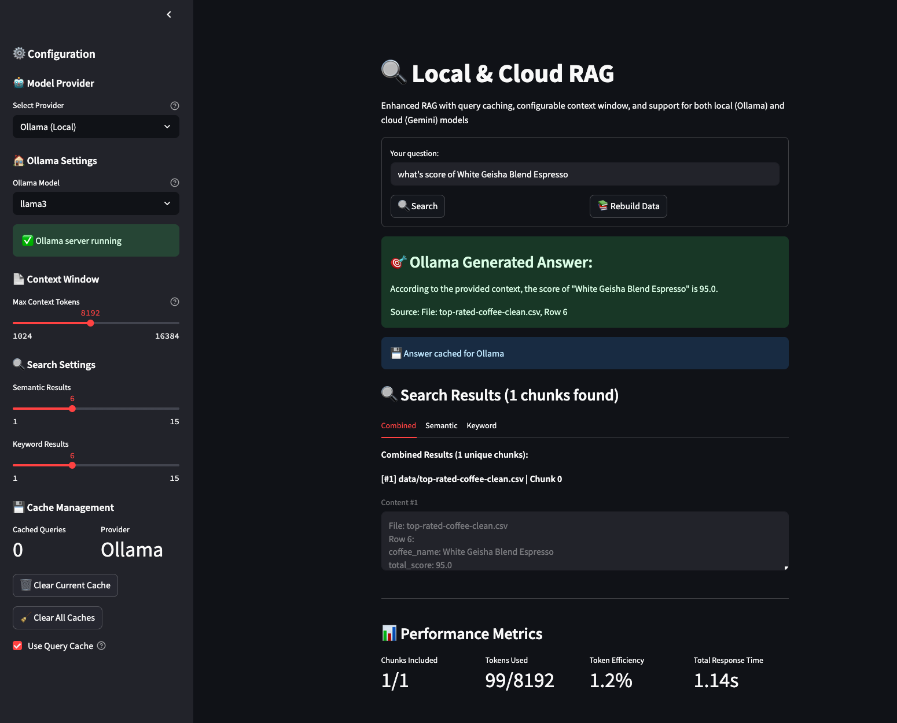

# Local RAG Pipeline with Gemini & Ollama

This project is a local Retrieval-Augmented Generation (RAG) pipeline that supports both cloud (Gemini) and local (Ollama) LLMs. It processes documents in various formats (PDF, DOCX, TXT, images, CSV etc.), builds a vector database, and enables semantic search and LLM-powered Q&A via web interface.

---

## High-Level Architecture

```
┌─────────────────┐    ┌──────────────────┐    ┌─────────────────┐
│   Data Layer    │───▶│  Processing      │───▶│   Storage       │
│                 │    │  Pipeline        │    │   Layer         │
│ • PDF files     │    │ • Document       │    │ • FAISS index   │
│ • CSV  files    │    │   parsing        │    │ • BM25 corpus   │
│ • TXT files     │    │ • Sentence       │    │ • Chunk         │
│ • Images        │    │   chunking       │    │   metadata      │
│ • Other formats │    │ • Embedding      │    │ • Query cache   │
└─────────────────┘    └──────────────────┘    └─────────────────┘
                                                        │
┌─────────────────┐    ┌──────────────────┐             │
│   User Layer    │◀───│   Retrieval      │◀────────────┘
│                 │    │   & Generation   │
│ • Web interface │    │ • Hybrid search  │    ┌─────────────────┐
│ • Query input   │    │ • Context build  │───▶│   LLM Layer     │
│ • Result display│    │ • Answer gen     │    │                 │
│ • Cache mgmt    │    │ • Caching        │    │ • Gemini API    │
└─────────────────┘    └──────────────────┘    │ • Ollama Local  │
                                               └─────────────────┘
```

## Component Details

#### 1. Document Processing Pipeline
**Purpose:** Convert various document formats into searchable chunks

**Process Flow:**
1. **Document Ingestion:** Handles PDF, DOCX, TXT, CSV images using format-specific parsers
2. **Text Extraction:** Extracts clean text while preserving structure and metadata
3. **Sentence Segmentation:** Uses NLTK punkt tokenizer for accurate sentence boundaries
4. **Chunking Strategy:** Creates overlapping chunks (8 sentences per chunk, 3 sentence overlap)
5. **Metadata Preservation:** Tracks source file, chunk index, and position information

**Key Technology Choices:**
- **Unstructured.io:** For robust multi-format document parsing
- **NLTK punkt:** For accurate sentence tokenization with fallback mechanisms
- **Overlap strategy:** Prevents context loss at chunk boundaries

#### 2. Embedding and Indexing System
**Purpose:** Create searchable vector representations and keyword indices

**Dual Index Approach:**
```python
# Semantic Index (FAISS)
embeddings = sentence_transformer.encode(chunk_texts)
faiss_index = faiss.IndexFlatIP(embedding_dimension)
faiss_index.add(embeddings)

# Keyword Index (BM25)
tokenized_corpus = [tokenize(text) for text in chunk_texts]
bm25_index = BM25Okapi(tokenized_corpus)
```

**Technology Rationale:**
- **Sentence Transformers (all-MiniLM-L6-v2):** Balance between quality and speed
- **FAISS:** Efficient vector similarity search with potential for scaling
- **BM25:** Captures exact keyword matches that embeddings might miss
- **Hybrid Approach:** Combines semantic understanding with precise keyword matching

#### 3. Retrieval System
**Purpose:** Find relevant chunks using multiple search strategies

**Retrieval Flow:**
1. **Query Processing:** Tokenize and embed user query
2. **Parallel Search:** Execute semantic (FAISS) and keyword (BM25) searches simultaneously
3. **Result Merging:** Combine and deduplicate results from both approaches
4. **Context Assembly:** Build coherent context within token limits

```python
# Parallel retrieval
semantic_results = faiss_index.search(query_embedding, k=5)
keyword_results = bm25_index.get_top_k(query_tokens, k=5)

# Smart merging with deduplication
merged_chunks = merge_and_dedupe(semantic_results, keyword_results)
context = build_context_with_token_limits(merged_chunks, max_tokens=4096)
```

#### 4. Generation Layer
**Purpose:** Generate answers using context-aware language models

**Dual Provider Architecture:**
- **Cloud Provider (Gemini):** High-quality responses with API dependency
- **Local Provider (Ollama):** Privacy-focused with local inference

**Context Management:**
- **Token Counting:** Precise token calculation using tiktoken
- **Smart Truncation:** Maintains sentence boundaries when truncating
- **Context Optimization:** Maximizes information density within token limits

#### 5. Caching System
**Purpose:** Optimize performance and reduce API costs

**Multi-Level Caching:**
```python
Cache Structure:
├── Query Normalization (lowercase, strip)
├── MD5 Hashing (collision-resistant keys)
├── Provider-Specific Storage (separate Gemini/Ollama caches)
└── LRU Eviction (maintains 100 most recent queries)
```

**Cache Benefits:**
- **Performance:** 10+ second queries → sub-millisecond responses
- **Cost Reduction:** Eliminates redundant API calls
- **User Experience:** Instant responses for repeated queries

---

## Screenshots

### Web Interface


The web interface provides:
- **Unified search bar** for natural language queries
- **Provider selection** (Gemini Cloud vs Ollama Local) with real-time status
- **Configurable settings** including context window size and search parameters
- **Query caching** with cache management controls
- **Generated answers** displayed prominently with source citations
- **Detailed search results** showing semantic and keyword matches
- **Performance metrics** including token usage and response times

---

---
### Data Flow Architecture

```
User Query
    │
    ▼
┌─────────────────┐
│  Query Cache    │─── Cache Hit ───┐
│  Check          │                 │
└─────────────────┘                 │
    │ Cache Miss                    │
    ▼                               │
┌─────────────────┐                 │
│  Hybrid         │                 │
│  Retrieval      │                 │
│  • FAISS Search │                 │
│  • BM25 Search  │                 │
└─────────────────┘                 │
    │                               │
    ▼                               │
┌─────────────────┐                 │
│  Context        │                 │
│  Assembly       │                 │
│  • Merge chunks │                 │
│  • Token mgmt   │                 │
└─────────────────┘                 │
    │                               │
    ▼                               │
┌─────────────────┐                 │
│  LLM Provider   │                 │
│  Selection      │                 │
│  • Gemini/Ollama│                 │
└─────────────────┘                 │
    │                               │
    ▼                               │
┌─────────────────┐                 │
│  Answer         │                 │
│  Generation     │                 │
└─────────────────┘                 │
    │                               │
    ▼                               │
┌─────────────────┐                 │
│  Cache Storage  │                 │
└─────────────────┘                 │
    │                               │
    ▼                               ▼
┌─────────────────────────────────────┐
│         Response to User            │
└─────────────────────────────────────┘
```
---

## Setup

1. **Clone the repo and create a virtual environment:**
   ```bash
   python3 -m venv venv
   source venv/bin/activate
   pip install -r requirements.txt
   ```

2. **Install Ollama (for local LLM):**
   - [Ollama install instructions](https://ollama.com/download)
   - Pull a model (e.g., `ollama pull llama3`)

3. **Set up Gemini API key (for cloud LLM):**
   - Add to your shell profile or export in your terminal:
     ```bash
     export GEMINI_API_KEY="your-gemini-api-key"
     ```

4. **Install NLTK data (for sentence chunking):**
   - The pipeline will attempt to auto-download, but you can also run:
     ```bash
     python3 -c "import nltk; nltk.download('punkt', download_dir='venv/nltk_data')"
     ```

---

## Usage

### 1. **Add your data**
- Place your documents in the `data/` folder (supports PDF, DOCX, TXT, CSV, images, etc.).

### 2. **Build and clean with Makefile**
- **Clean all outputs:**
  ```bash
  make clean
  ```
- **Run the full pipeline:**
  ```bash
  make all
  ```
  This will parse, chunk (sentence-based), embed, and index your documents.

### 3. **Query your knowledge base**

**With Ollama (local LLM):**

- **Start Ollama:**
  ```bash
  ollama serve
  # and pull a model if needed: ollama pull llama3
  ```

- **Single interface supporting both Gemini and Ollama:**

  ```bash
  make web
  # or
  streamlit run scripts/web_rag.py
  ```
  - Switch between providers in the sidebar
  - Separate caching for each provider
  - Provider-specific model selection
  - Real-time connection status


### 4. **Evaluate Search Quality**
- Run the evaluation script to test search quality on sample queries:
  ```bash
  python scripts/evaluate_search.py
  ```

---

## Requirements
- Python 3.9+
- See `requirements.txt` for Python dependencies (pip install -r requirements.txt)
- [Ollama](https://ollama.com/) for local LLM (optional)
- Gemini API key (optional, for cloud LLM)

---

## License
MIT 